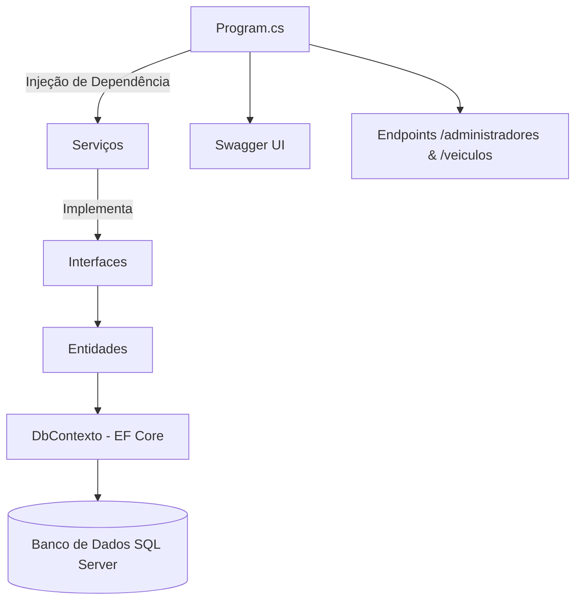

# 🚀 API Minimal de Veículos - DIO Project

---

## 📖 Sobre o Projeto

Este projeto foi desenvolvido como parte de um **desafio prático da [Digital Innovation One (DIO)](https://www.dio.me)**, com o objetivo de aplicar conceitos aprendidos sobre **.NET 9**, **Entity Framework**, **Swagger** e **Minimal APIs**.

A aplicação é uma **API para gerenciamento de veículos e administradores**, construída com boas práticas de arquitetura e separação de responsabilidades entre as camadas **Domínio** e **Infraestrutura**.

---

## 🧠 Conceitos Aplicados

- Minimal API (estrutura simplificada)
- Entity Framework Core (ORM e Migrations)
- Injeção de Dependência (DI)
- Padrões de Projeto e Camadas
- Validação de Dados
- Swagger para documentação e testes
- Mapeamento de DTOs e ModelViews
- Migrations e Seed de Dados

---

## 🧩 Estrutura do Projeto

📦 ApiMinimal

┣ 📂 Dominio

┃ ┣ 📂 Entidades

┃ ┃ ┣ 📂 Servicos

┃ ┃ ┃ ┣ 📂 DTO

┃ ┃ ┃ ┃ ┣ 📜 AdministradorDTO.cs

┃ ┃ ┃ ┃ ┣ 📜 LoginDTO.cs

┃ ┃ ┃ ┃ ┗ 📜 VeiculoDTO.cs

┃ ┃ ┃ ┣ 📜 AdministradorServico.cs

┃ ┃ ┃ ┗ 📜 VeiculoServico.cs

┃ ┃ ┣ 📜 Veiculo.cs

┃ ┣ 📂 Enuns

┃ ┃ ┗ 📜 Perfil.cs

┃ ┣ 📂 Interfaces

┃ ┃ ┣ 📜 IAdministradorServico.cs

┃ ┃ ┗ 📜 IVeiculoServico.cs

┃ ┣ 📂 ModelViews

┃ ┃ ┣ 📜 Home.cs

┃ ┃ ┗ 📜 ErroDeValidacao.cs

┃ ┗ 📜 Administrador.cs

┣ 📂 Infraestrutura

┃ ┗ 📜 DbContexto.cs

┣ 📜 Program.cs

┗ 📜 appsettings.json

---

## 🧱 Diagrama da Arquitetura

## 🗄️ Migrations Existentes

| Migration                    | Descrição                                       |
| ---------------------------- | ----------------------------------------------- |
| `AdministradorMigration`     | Criação inicial da tabela de administradores    |
| `SeedAdministrador`          | Inserção do administrador padrão                |
| `AtualizarSeedAdministrador` | Atualização do seed inicial                     |
| `VeiculosMigrations`         | Criação da tabela de veículos                   |
| `CriarTabelaVeiculos`        | Ajuste final da estrutura da tabela de veículos |

## 🧍‍♂️ Entidades Principais

# 🧑‍💼 Administrador

| Propriedade | Tipo         | Restrição    |
| ----------- | ------------ | ------------ |
| Id          | int          | PK, Identity |
| Email       | string (200) | Required     |
| Senha       | string (50)  | Required     |
| Perfil      | string (50)  | Required     |

# 🚗 Veículo

| Propriedade | Tipo         | Restrição        |
| ----------- | ------------ | ---------------- |
| Id          | int          | PK, Identity     |
| Nome        | string (150) | Required         |
| Marca       | string (100) | Required         |
| Ano         | int          | Required (>1900) |

## ⚙️ Endpoints Principais

# 🌐 Rota Base

GET /

Retorno:

{
  "mensagem": "Bem vindo a API de veículos - Minimal API",
  "doc": "/swagger"
}

# 👨‍💼 Administradores

| Método | Rota                     | Descrição                           |
| ------ | ------------------------ | ----------------------------------- |
| POST   | `/administradores/login` | Realiza login com e-mail e senha    |
| GET    | `/administradores`       | Lista todos os administradores      |
| GET    | `/administradores/{id}`  | Retorna um administrador específico |
| POST   | `/administradores`       | Cria um novo administrador          |

Exemplo de requisição (POST /administradores):

{
  "email": "adm@teste.com",
  "senha": "123456",
  "perfil": "adm"
}

# 🚘 Veículos

| Método | Rota             | Descrição                     |
| ------ | ---------------- | ----------------------------- |
| GET    | `/veiculos`      | Lista todos os veículos       |
| GET    | `/veiculos/{id}` | Retorna um veículo pelo ID    |
| POST   | `/veiculos`      | Adiciona um novo veículo      |
| PUT    | `/veiculos/{id}` | Atualiza um veículo existente |
| DELETE | `/veiculos/{id}` | Remove um veículo existente   |

Exemplo de criação de veículo (POST /veiculos):

{
  "nome": "Civic",
  "marca": "Honda",
  "ano": 2023
}

