# 🚀 API Minimal de Veículos - DIO Project


---

## 📖 Sobre o Projeto

Este projeto foi desenvolvido como parte de um **desafio prático da [Digital Innovation One (DIO)](https://www.dio.me)**, com o objetivo de aplicar conceitos aprendidos sobre **.NET 9**, **Entity Framework**, **Swagger** e **Minimal APIs**.

A aplicação é uma **API para gerenciamento de veículos e administradores**, construída com boas práticas de arquitetura e separação de responsabilidades entre as camadas **Domínio** e **Infraestrutura**.

---

## 🧠 Conceitos Aplicados

- Minimal API (estrutura simplificada)
- Entity Framework Core (ORM e Migrations)
- Injeção de Dependência (DI)
- Padrões de Projeto e Camadas
- Validação de Dados
- Swagger para documentação e testes
- Mapeamento de DTOs e ModelViews
- Migrations e Seed de Dados

---

## 🧩 Estrutura do Projeto

📦 ApiMinimal

┣ 📂 Dominio

┃ ┣ 📂 Entidades

┃ ┃ ┣ 📂 Servicos

┃ ┃ ┃ ┣ 📂 DTO

┃ ┃ ┃ ┃ ┣ 📜 AdministradorDTO.cs

┃ ┃ ┃ ┃ ┣ 📜 LoginDTO.cs

┃ ┃ ┃ ┃ ┗ 📜 VeiculoDTO.cs

┃ ┃ ┃ ┣ 📜 AdministradorServico.cs

┃ ┃ ┃ ┗ 📜 VeiculoServico.cs

┃ ┃ ┣ 📜 Veiculo.cs

┃ ┣ 📂 Enuns

┃ ┃ ┗ 📜 Perfil.cs

┃ ┣ 📂 Interfaces

┃ ┃ ┣ 📜 IAdministradorServico.cs

┃ ┃ ┗ 📜 IVeiculoServico.cs

┃ ┣ 📂 ModelViews

┃ ┃ ┣ 📜 Home.cs

┃ ┃ ┗ 📜 ErroDeValidacao.cs

┃ ┗ 📜 Administrador.cs

┣ 📂 Infraestrutura

┃ ┗ 📜 DbContexto.cs

┣ 📜 Program.cs

┗ 📜 appsettings.json


---

## 🧱 Diagrama da Arquitetura

```mermaid
flowchart TD
    A[Program.cs] -->|Injeção de Dependência| B[Serviços]
    B -->|Implementa| C[Interfaces]
    C --> D[Entidades]
    D --> E[DbContexto - EF Core]
    E --> F[(Banco de Dados SQL Server)]
    
    A --> G[Swagger UI]
    A --> H[Endpoints /administradores & /veiculos]

```



## 🗄️ Migrations Existentes


| Migration                    | Descrição                                       |
| ---------------------------- | ----------------------------------------------- |
| `AdministradorMigration`     | Criação inicial da tabela de administradores    |
| `SeedAdministrador`          | Inserção do administrador padrão                |
| `AtualizarSeedAdministrador` | Atualização do seed inicial                     |
| `VeiculosMigrations`         | Criação da tabela de veículos                   |
| `CriarTabelaVeiculos`        | Ajuste final da estrutura da tabela de veículos |


## 🧍‍♂️ Entidades Principais

### 🧑‍💼 Administrador


| Propriedade | Tipo         | Restrição    |
| ----------- | ------------ | ------------ |
| Id          | int          | PK, Identity |
| Email       | string (200) | Required     |
| Senha       | string (50)  | Required     |
| Perfil      | string (50)  | Required     |


### 🚗 Veículo


| Propriedade | Tipo         | Restrição        |
| ----------- | ------------ | ---------------- |
| Id          | int          | PK, Identity     |
| Nome        | string (150) | Required         |
| Marca       | string (100) | Required         |
| Ano         | int          | Required (>1900) |


## ⚙️ Endpoints Principais


### 🌐 Rota Base

GET /

Retorno:

````
{
  "mensagem": "Bem vindo a API de veículos - Minimal API",
  "doc": "/swagger"
}
````

### 👨‍💼 Administradores


| Método | Rota                     | Descrição                           |
| ------ | ------------------------ | ----------------------------------- |
| POST   | `/administradores/login` | Realiza login com e-mail e senha    |
| GET    | `/administradores`       | Lista todos os administradores      |
| GET    | `/administradores/{id}`  | Retorna um administrador específico |
| POST   | `/administradores`       | Cria um novo administrador          |


Exemplo de requisição (POST /administradores):

````
{
  "email": "adm@teste.com",
  "senha": "123456",
  "perfil": "adm"
}
````

### 🚘 Veículos


| Método | Rota             | Descrição                     |
| ------ | ---------------- | ----------------------------- |
| GET    | `/veiculos`      | Lista todos os veículos       |
| GET    | `/veiculos/{id}` | Retorna um veículo pelo ID    |
| POST   | `/veiculos`      | Adiciona um novo veículo      |
| PUT    | `/veiculos/{id}` | Atualiza um veículo existente |
| DELETE | `/veiculos/{id}` | Remove um veículo existente   |


Exemplo de criação de veículo (POST /veiculos):

````
{
  "nome": "Civic",
  "marca": "Honda",
  "ano": 2023
}
`````

##🧪 Como Executar o Projeto

###1️⃣ Clone o repositório

````
git clone https://github.com/stephtavzz/minimal-api.git
````

###2️⃣ Configure o banco de dados

No arquivo appsettings.json, adicione sua connection string:

````
"ConnectionStrings": {
  "ConexaoPadrao": "Server=localhost;Database=ApiMinimalDB;Trusted_Connection=True;TrustServerCertificate=True;"
}
````

###3️⃣ Execute as migrations

````
dotnet ef database update
````

###4️⃣ Execute o projeto

````
dotnet run
`````

Acesse a documentação interativa (Swagger):
👉 http://localhost:5000/swagger


## 🧰 Tecnologias Utilizadas

| Tecnologia                  | Descrição                      |
| --------------------------- | ------------------------------ |
| **C#**                      | Linguagem principal            |
| **.NET 9**                  | Framework utilizado            |
| **Entity Framework Core**   | ORM para persistência de dados |
| **SQL Server**              | Banco de dados relacional      |
| **Swagger (Swashbuckle)**   | Documentação da API            |
| **Visual Studio / VS Code** | Ambiente de desenvolvimento    |

## 💾 Exemplo de Retorno (Swagger)

````
[
  {
    "id": 1,
    "nome": "Fiesta",
    "marca": "Ford",
    "ano": 2019
  }
]
````

## 🧑‍💻 Autora

Stephanie Tavares dos Santos
🎓 Formada em Jogos Digitais e Técnico em Desenvolvimento de Sistemas
💼 Experiência com C#, Entity Framework, Modelagem 3D e Design Digital


##🌐 Inspiração - DIO Challenge

“Agora é a sua hora de brilhar e construir um perfil de destaque na DIO!
Explore todos os conceitos explorados até aqui e replique (ou melhore!) este projeto prático.”


